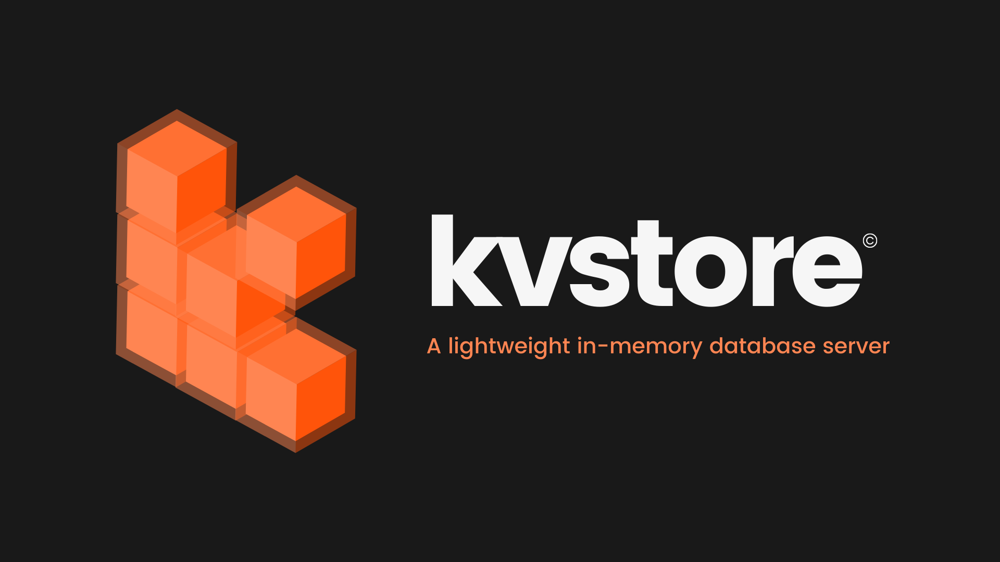
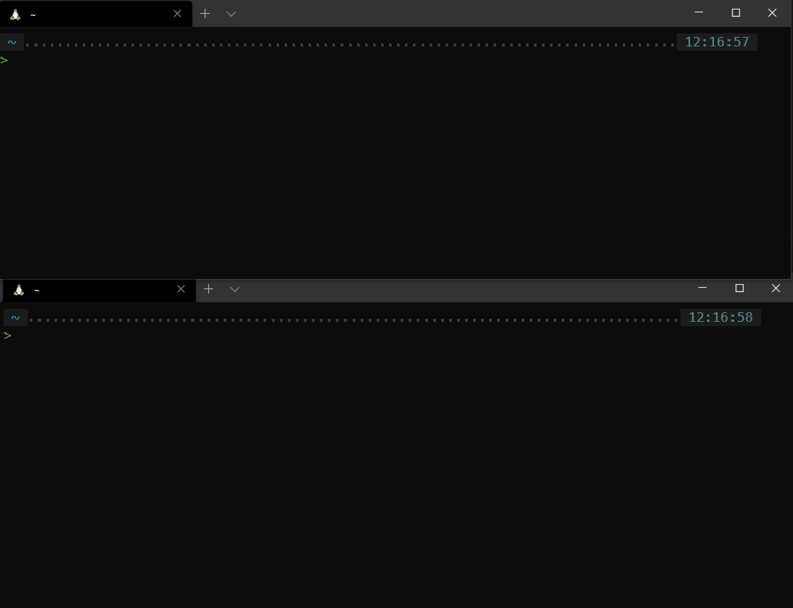

# **kvstore**

**kvstore** is an in-memory database server with the key-value model.



# NOTE

This project is not **yet** targeted for production use. This project is currently marked as experimental and for educational purposes only.

Want to expand this project? open up an [issue](https://github.com/HotPotatoC/kvstore/issues/new) or you can contact me on juandotulung@gmail.com

# Install


You can install the binaries in the [releases](https://github.com/HotPotatoC/kvstore/releases) tab.


**Using [docker](https://www.docker.com/)**
```sh
❯ docker run --name kvstore -d -p 7275:7275 hotpotatoc123/kvstore-server:latest
```

**Running with [go](https://golang.org/dl/)**
```sh
# This will install the latest versions of the 2 commands 'kvstore-server' and 'kvstore-cli'
❯ GO111MODULE=on go get -u github.com/HotPotatoC/kvstore
```

**Manual**

```sh
❯ git clone https://github.com/HotPotatoC/kvstore.git

❯ cd kvstore

❯ make install # Installs 2 commands 'kvstore-server' and 'kvstore-cli'
```

# Getting started

Running the kvstore server using the `kvstore-server` command

```sh
❯ kvstore-server

2021-04-15T17:08:10.177+0700    KVStore is starting...
2021-04-15T17:08:10.177+0700    version=v1.0.0 build=6ccb99fc20a525ceb8ca384bd2b3967337661874 pid=22183
2021-04-15T17:08:10.177+0700    starting tcp server...

       .
   .-"   "-
 .n         "w
 |  ^~   ⌐"  |
 |     ╠     |        .
 |     ╡    ⌐|    .-"   "-
 .╜"-. ╡ .─"  . #¬        .┴|
 |  ^~ ".⌐'.-"  ╫   ^¬.-"   |
 |     | #¬     |     |     |
 |     | |  ^¬ .╝.    |    ⌐"
 .╜"-. | |    |    "-.|,^         Started kvstore v1.0.0 server
 |  ^¬ " ╜    |     ,               Port: 7275
 |     | m""-.| ,─".X .             PID: 22183
 |     | |  ^¬  ⌐'.⌐"   "─
  " ─. | |    | ╡╜        .╜|
       " |    | |   ^¬.-"   |
          " ─.| |     |     |
                ╙.    |    ⌐*
                   "─.|,^

2021-04-15T17:08:10.178+0700    Ready to accept connections.
```

To interact with the server, on another terminal run the `kvstore-cli` command

```sh
❯ kvstore-cli

🚀 Connected to kvstore v1.0.0:6ccb99fc20a525ceb8ca384bd2b3967337661874 server!

127.0.0.1:7275> info
{
  "version": "v1.0.0",
  "build": "6ccb99fc20a525ceb8ca384bd2b3967337661874",
  "os": "linux",
  "os_arch": "amd64",
  "go_version": "go1.16.3",
  "process_id": 1,
  "tcp_host": "0.0.0.0",
  "tcp_port": 7275,
  "server_uptime": 112609159300,
  "server_uptime_human": "1m52.6091594s",
  "connected_clients": 1,
  "total_connections_count": 1,
  "memory_usage": 455056,
  "memory_usage_human": "444.4 kB",
  "memory_total_alloc": 455056
}

127.0.0.1:7275>
```

# Command Table

| Command (Case insensitive)    | Description                                                                                     |
| ----------------------------- | ----------------------------------------------------------------------------------------------- |
| SET [key] [value]             | Insert a new entry into the database                                                            |
| SETEX [key] [value] [seconds] | Insert a new expirable entry into the database                                                  |
| GET [key]                     | Return the data in the database with the matching key                                           |
| DEL [key]                     | Remove an entry in the database with the matching key                                           |
| LIST                          | Display all the saved data in the database with the format `[key] -> [value]`                   |
| KEYS                          | Display all the saved keys in the database                                                      |
| FLUSH                         | Delete all keys                                                                                 |
| INFO                          | Display the current stats of the server (OS, mem usage, total connections, etc.) in json format |

# Contributing

Pull requests are welcome. For major changes, please open an issue first to discuss what you would like to change.

# License

[MIT](https://choosealicense.com/licenses/mit/)

# Support

<a href="https://www.buymeacoffee.com/hotpotato" target="_blank"></a>
